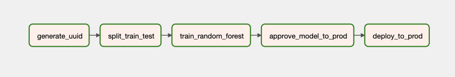
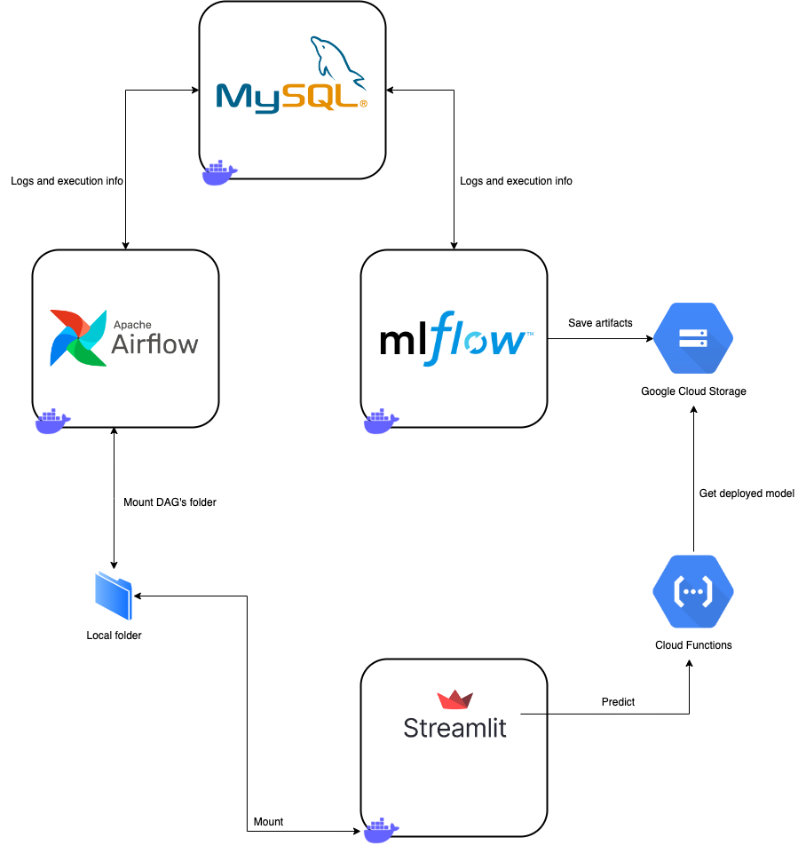
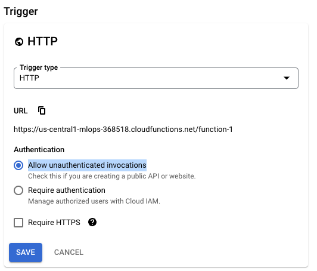
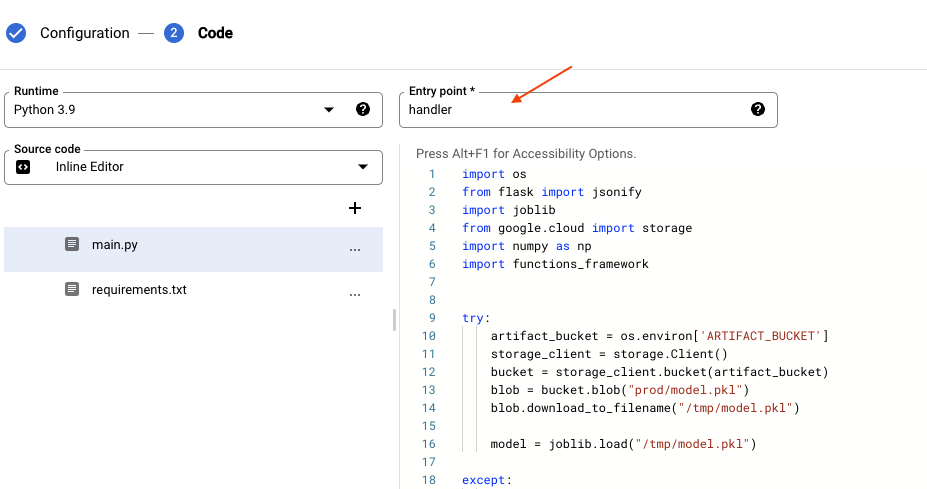
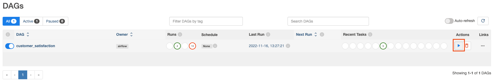
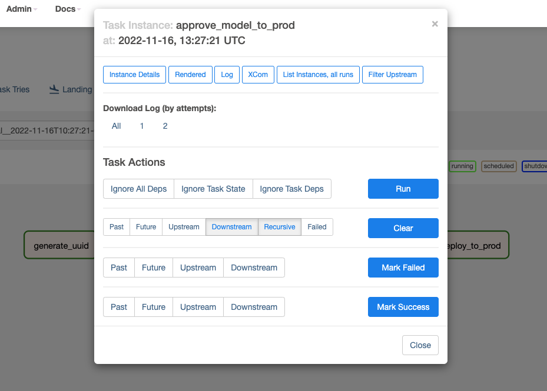

# MLOps Development Environment

Have you ever want to improve your skills creating full pipelines with Airflow, MLFlow, and cloud but found dificult to build the local infrastructure for that?

This project aims to build a full development environment where you can write your own pipelines connecting MLFLow, Airflow, GCP and Streamlit, and build amazing MLOps pipelines to practice your skills!

To help you, we provide a toy example where you will train a model with different parameters, choose the best one, deploy it to production (using a Cloud Function as API) and consume it in a Streamlit UI.

The training pipeline will be constructed in Airflow with a manual approval step to deploy to prod. Everything will be logged into MLFLow.



## About the repository

The repository is organized as follow:

- **db:** Folder containing initialization scripts to build the users and databases to be used by Airflow and MLFlow.

- **mlflow:** Folder containing Dockerfile to build the container that will host MLFlow for us.

- **airflow:** Folder containing Dockerfile to build the container that will host Airflow, and a initialization script to start all components from Airflow inside the container.

- **src:** This folder contains all the *real code* that we will use. Inside it you will find a Dockerfile that builds a container to host a Jupyter Notebook (if you want to use) and a Streamlit server. Also, you will see a folder called **cloud_function**, where we have the code we will deploy to the cloud function in our toy example. A folder called **dags**, which we mount in the Airflow container and everytime we change something, it reflects in the Airflow container and refreshs the DAGs there. Finally, we have a folder called **streamlit**, where you have the code to create a cool interface and interact with your prediction API.

### Technologies used

- Airflow
- Cloud Functions (GCP)
- Cloud Storage (GCP)
- Docker
- Docker Compose
- MLFlow
- MySql
- Streamlit

## How it works

You can modify as you want, but to delivery a start point we bring a toy example. In this example we want to train some models, logging everything we can about it, select the best model, deploy to a cloud function (I wanted to keep it as simple as possible) and finally call this using a Streamlit interface. In the image below you can see the architecture of our example.



## Setup (About 10 minutes)

1. You must have a [Google Account](https://cloud.google.com/cloud-console).
2. Go to IAM > Service Account page.
3. Click on **CREATE SERVICE ACCOUNT**. Select a name and permissions (you can choose Basic > Editor). Create it!
4. Go back to the service account page and click in the service account you created (find it by the name you choose). Go to the **KEYS** tab.
5. Click in **ADD KEY** > **Create new key** > **JSON**. A file will be downloaded in your machine.
6. Copy this file and paste inside credentials folder in `airflow/creadentials` and `src/credentials`.
7. Go to [.env](./.env) and change replace \<YOUR SERVICE ACCOUNT FILE NAME\>, like: <YOUR SERVICE ACCOUNT FILE NAME\> -> my_service_account.json
8. Now, go back to GCP console and create a bucket.
9. Copy the name and replace it inside [.env](./.env).
10. In GCP Console again, go to Cloud Functions > Create Function (on the top). Choose a name for your function. On Trigger Section, select HTTPS, mark *Allow unauthenticated invocations* and disable *Require HTTPS*.



Expand *Runtime, build, connections and security settings* section. In *Runtime service account* select the service account you created. In the bottom click on *Add Variable* and create a variable called **ARTIFACT_BUCKET** and write the name of the bucket you created.


11. In the next page, select python39 as runtime and copy the content from `src/cloud_function/lambda_deployment.py` inside `main.py` in the browser and the content of `src/cloud_function/requirements.txt` to `requirements.txt`. Also, change the entrypoint to *handler*.



12. Go to `/src/streamlit/ui.py` and replace \<YOUR CLOUD FUNCTION URL\> in line 10 by your function URL (after your function is deployed, you can find it inside trigger tab)

13. Run `docker compose --env-file .env up`

## Running

Now that everything is up running we can start to play! To do that, open your Airflow UI at `http://localhost:8080` (username and password is *airflow*) and your MLFlow server at `http://localhost:5000`.

Before everything, go to the bucket you created and upload the file `/bases/train.csv` to there. We will use it to trigger Airflow.

In Airflow, you should see a DAG called **customer_satisfaction**. Click on the start button on the right and select **Trigger DAG w/ config**:



Write a RunID name and inside the configuration paste something like:

```json
{"max_depth": 2, "dataset_path": <YOUR-BUCKET>}
```

Replacing \<YOUR-BUCKET\> by the gcs path where your data is. If you followed everything, it should be something like: `gs://<ARTIFACT_BUCKET>/train.csv`, where ARTIFACT_BUCKET should be replaced by your bucket name.

After click in *Trigger*, if you go to MLFlow you will be able to see some metrics and parameters being logged there. The idea here is: start some Airflow DAGs with different *max_depth*, take a look in MLFlow to see which one performs better, and go back to Airflow and deploy the selected execution to production. To do that, we created a *fake operator*, which fails automatically and you need to mannualy mark as success in order to make the DAG finishes. If you don't click it means that the model of this execution won't be in production.

To do that, go to the chosen execution and click in **approve_model_to_prod** > **Mark success**.



Finally, you can go to `http://localhost:8501` and run a batch predict using the file available in `bases/my_csv.csv`


## Next steps

If you want to learn more and try advanced things i will give some ideas:

- Add a data transformation step in Airflow
- Use TFX to create the Airflow pipeline
- Create a pipeline where you can say the model you want to train and the parameters
- Deploy the model using Vertex AI
